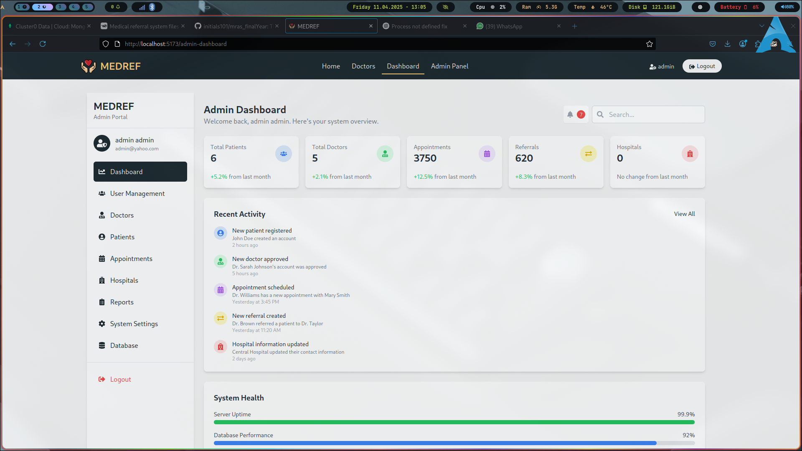
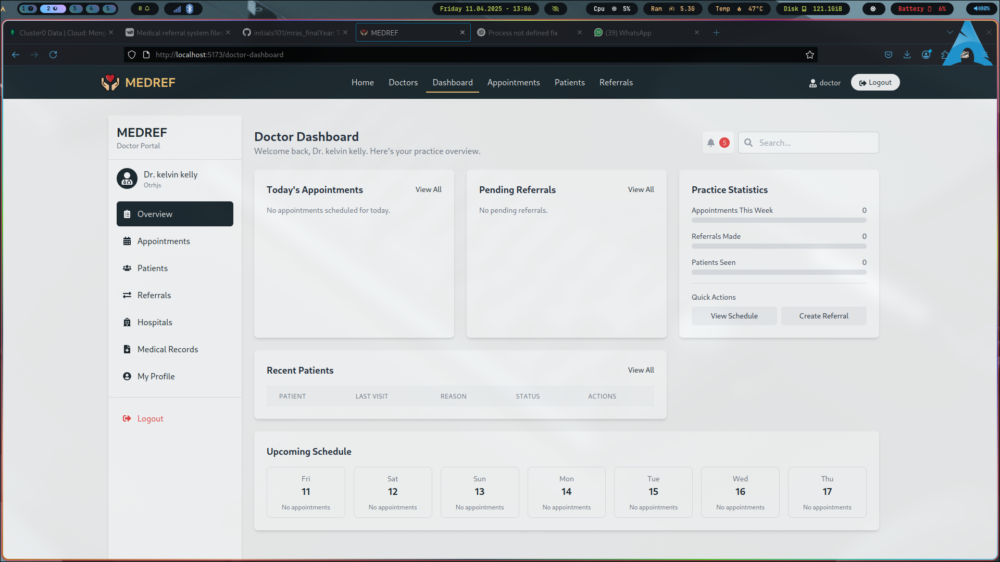
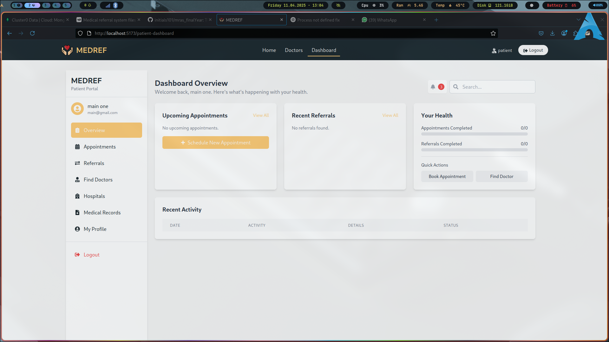

# 🏥 Medical Referral Appointment System

A web-based platform built with the **MERN stack** that facilitates medical referrals and appointments between **patients**, **doctors**, and **hospitals**.

---

## 🚀 Features

- 👤 **User Roles**: Admin, Doctor, Patient
- 📅 Appointments booking & management
- 📄 Medical referrals with detailed history
- 🏥 Hospital and doctor search
- 🧾 Patient medical records upload and view

---

## 📸 Screenshots

### 🛠️ Admin Dashboard  
_Manage hospitals and users_  

---

### 🩺 Doctor Dashboard  
_View/create referrals and manage appointments_  

---

### 👤 Patient Dashboard  
_View doctors and book appointments_  

---

## 📡 API Endpoints

### 🔐 Authentication

- `POST /api/auth/register` — Register user  
- `POST /api/auth/login` — Login  
- `POST /api/auth/verify` — Verify email with OTP  
- `POST /api/auth/resend-otp` — Resend OTP  
- `GET /api/auth/profile` — Get profile  
- `PUT /api/auth/profile` — Update profile

---

### 👥 User Management (Admin Only)

- `GET /api/users` — All users  
- `GET /api/users/:id` — User by ID  
- `PUT /api/users/:id` — Update user  
- `DELETE /api/users/:id` — Delete user

---

### 🧑‍⚕️ Doctor

- `POST /api/doctors` — Create doctor profile  
- `GET /api/doctors/profile` — Get profile  
- `PUT /api/doctors/profile` — Update profile  
- `GET /api/doctors` — All doctors  
- `GET /api/doctors/:id` — Doctor by ID  
- `GET /api/doctors/specialization/:specialization` — Filter by specialization  
- `GET /api/doctors/hospital/:hospitalId` — Filter by hospital

---

### 🧑‍🤝‍🧑 Patient

- `POST /api/patients` — Create patient profile  
- `GET /api/patients/profile` — Get profile  
- `PUT /api/patients/profile` — Update profile  
- `GET /api/patients` — All patients  
- `GET /api/patients/:id` — Patient by ID

---

### 🏥 Hospitals

- `POST /api/hospitals` — Create hospital  
- `GET /api/hospitals` — All hospitals  
- `GET /api/hospitals/:id` — Hospital by ID  
- `PUT /api/hospitals/:id` — Update hospital  
- `DELETE /api/hospitals/:id` — Delete hospital  
- `GET /api/hospitals/search` — Search hospitals by keyword

---

### 📅 Appointments

- `POST /api/appointments` — Create appointment  
- `GET /api/appointments/patient` — Patient’s appointments  
- `GET /api/appointments/doctor` — Doctor’s appointments  
- `GET /api/appointments/all` — All appointments (Admin)  
- `GET /api/appointments/:id` — Appointment by ID  
- `PUT /api/appointments/:id/status` — Update status  
- `PUT /api/appointments/:id/cancel` — Cancel appointment

---

### 🔁 Referrals

- `POST /api/referrals` — Create referral  
- `GET /api/referrals/patient` — Patient referrals  
- `GET /api/referrals/referring` — Doctor-sent referrals  
- `GET /api/referrals/referred` — Incoming referrals  
- `GET /api/referrals/all` — All referrals (Admin)  
- `GET /api/referrals/:id` — Referral by ID  
- `PUT /api/referrals/:id/status` — Update referral status  
- `POST /api/referrals/:id/appointment` — Create appointment from referral

---

### 🧾 Medical Records

- `POST /api/medical-records/upload` — Upload medical record  
- `GET /api/medical-records/patient/:patientId` — Records by patient  
- `GET /api/medical-records/:id` — Record by ID  
- `GET /api/medical-records/download/:id` — Download  
- `DELETE /api/medical-records/:id` — Delete record

---

### 🧑‍💼 Admin

- `POST /api/admins` — Create admin profile  
- `GET /api/admins/profile` — Get admin profile  
- `PUT /api/admins/profile` — Update profile  
- `GET /api/admin/db-stats` — View DB stats

---

## ⚙️ Tech Stack

- **Frontend**: React + Tailwind + Redux + Framer Motion
- **Backend**: Node.js + Express
- **Database**: MongoDB
- **Authentication**: JWT
- **Deployment**: Docker, Render/AWS (optional)

---

## 🛠️ Setup Instructions

1. Clone the repo  
   `git clone https://github.com/your-username/your-repo.git`

2. Install dependencies  
   `npm install` (both frontend & backend)

3. Configure `.env` files for backend and frontend

4. Start servers  
   Backend: `npm run dev`  
   Frontend: `npm run dev`

---

## 🙌 Contributing

Pull requests are welcome. Open an issue first to discuss changes or features.

---

## 📄 License

MIT License — Free for personal and commercial use.

